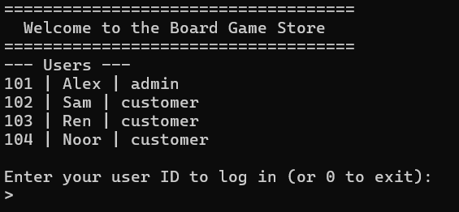
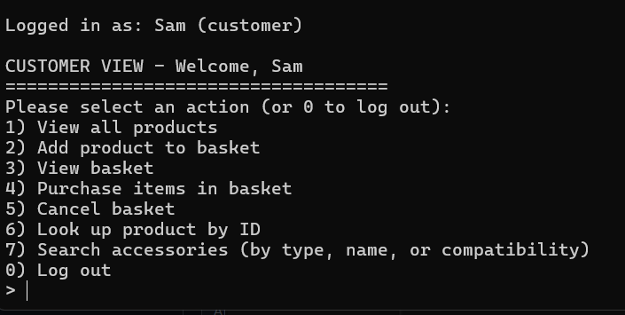
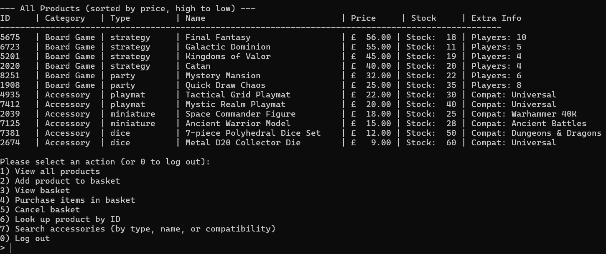
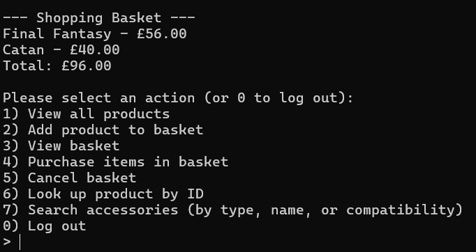
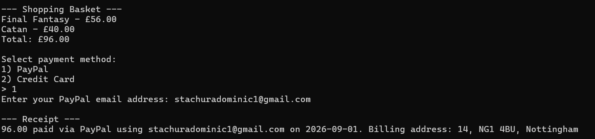
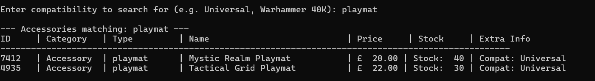
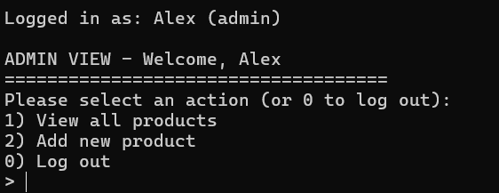
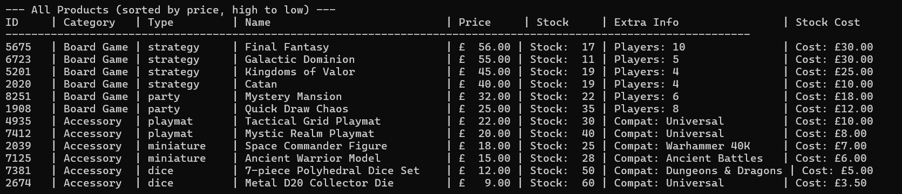

# Board Game Store — Java OOP Coursework Project

A console-based (CLI) stock and sales management system for a board game store, built in Java. Admins can manage stock, and customers can browse products, build a basket, and check out. The project was built as a piece of university coursework, with the primary goal of practising core **object-oriented programming (OOP)** concepts in Java — not to be a real, deployable retail system.

## Important: what this project actually is

This is a **learning exercise**, not a secure or production-ready application. A few things are worth being upfront about before anyone browses the code expecting real-world security practices:

- **There is no real authentication.** Logging in only requires typing a numeric user ID — there are no passwords. Before you're even asked to log in, the program prints every user's ID, name, and role straight to the console (see `Main.printUserList`), so anyone running the program can see exactly which ID belongs to the admin and log in as them.
- **User and stock data is stored in plain text.** `UserAccounts.txt` and `Stock.txt` are unencrypted, human-readable files with no access control. Anyone with access to the files can read or edit them directly, bypassing the application entirely.
- **Payments aren't real.** `CreditCardPayment` and `PaypalPayment` only validate the *format* of the input (e.g. a 6-digit card number) — no payment is actually processed anywhere.

None of this is an oversight to be fixed later — it reflects the scope of the assignment, which was focused on class design, inheritance, interfaces, and encapsulation rather than authentication or security. If you're looking at this repo as a portfolio piece, treat it as a demonstration of OOP structure, not a template for handling real user data or payments.

## Overview

The application is a single command-line program (`CLIs.Main`) that:

1. Loads users from `UserAccounts.txt` and stock from `Stock.txt` on startup.
2. Asks for a user ID to "log in".
3. Routes to one of two menus depending on role — an **Admin CLI** or a **Customer CLI**.

Two product types are supported: **Board Games** and **Accessories**, each with their own type-specific attributes (max players / compatibility) and admin-only cost visibility.

## Features



### Customer


- View all products, sorted highest to lowest price (purchase cost hidden)
  

  
- Add products to a shopping basket, with checks against available stock & view the current basket and running total
  


- Purchase the basket via **PayPal** or **Credit Card**, generating a receipt and decrementing stock

  
  
- Cancel/clear the basket
- Look up a single product by its 4-digit ID
- Search accessories by compatibility, name, or type (e.g. searching "dice" or "Universal")
  
  


### Admin



- View all products, sorted highest to lowest price, **including purchase cost**

 
 
- Add a new product to stock, with full input validation:
  - Board games require a game type (strategy/party) and max player count
  - Accessories require an accessory type (dice/miniature/playmat/accessory kit) and a compatibility string
  - Product IDs must be unique and exactly 4 digits

  

## Object-oriented concepts demonstrated

This project was written specifically to put the following OOP principles into practice:

| Concept | Where it shows up |
|---|---|
| **Abstraction** | `Product` and `User` are abstract classes that define shared structure but leave `toString()` / `getRole()` to be implemented by subclasses |
| **Inheritance** | `BoardGame` and `Accessory` extend `Product`; `Admin` and `Customer` extend `User` |
| **Polymorphism** | `AdminCLI` iterates over a `List<Product>` and calls type-specific `toAdminString()` via `instanceof` checks; each subclass overrides `toString()` differently |
| **Encapsulation** | All fields are private with controlled access via getters (and very limited setters, e.g. `setQuantityInStock`) |
| **Interfaces** | `PaymentMethod` (implemented by `CreditCardPayment` and `PaypalPayment`); `Searchable` (implemented by `StockManager`) |
| **Enums** | `ProductCategory`, `GameType`, `AccessoryType` — used instead of raw strings for type safety |
| **Fail-fast validation** | Constructors (`BoardGame`, `Accessory`, `Address`, `CreditCardPayment`, `PaypalPayment`) throw `IllegalArgumentException` immediately on invalid input, so an invalid object can never exist |
| **Separation of concerns** | CLI classes (presentation) are kept separate from domain classes (`Product`, `User`, etc.) and data-access classes (`StockManager`, `UserManager`) |

## Project structure

```
├── CLIs/
│   ├── Main.java              # Entry point — loads data, handles login, routes to a CLI
│   ├── AdminCLI.java           # Admin menu: view stock, add products
│   └── CustomerCLI.java        # Customer menu: browse, basket, checkout, search
│
├── CourseworkFiles/
│   ├── Product.java             # Abstract base class for all products
│   ├── ProductCategory.java     # Enum: BOARDGAME, ACCESSORY
│   └── PaymentMethod.java       # Interface implemented by payment types
│
├── Payment/
│   ├── CreditCardPayment.java   # Validates card number/security code, generates a receipt
│   ├── PaypalPayment.java       # Validates email, generates a receipt
│   └── Receipt.java             # Simple message + date holder
│
├── Store/
│   ├── StockManager.java        # Loads/saves Stock.txt, search + filter logic
│   ├── ShoppingBasket.java      # Per-customer basket of products
│   ├── BoardGame.java           # Product subtype: game type, max players
│   ├── Accessory.java           # Product subtype: accessory type, compatibility
│   ├── GameType.java            # Enum: STRATEGY, PARTY
│   ├── AccessoryType.java       # Enum: DICE, MINIATURE, PLAYMAT, ACCESSORY_KIT
│   └── Searchable.java          # Interface for lookup/filter operations
│
├── User/
│   ├── User.java                 # Abstract base class for all users
│   ├── Admin.java                # User subtype with admin role
│   ├── Customer.java             # User subtype with a ShoppingBasket
│   ├── UserManager.java          # Loads UserAccounts.txt
│   └── Address.java              # Value object for a user's address
│
├── Stock.txt                    # Product data (loaded/saved by StockManager)
└── UserAccounts.txt              # User data (loaded by UserManager)
```

> Adjust the `javac`/`java` commands below if your IDE places these packages under a different source root (e.g. `src/main/java`).

## Data files

Both data files are plain-text and semicolon-delimited, loaded relative to the directory the program is run from.

**`Stock.txt`** — `id; category; type; name; price; quantityInStock; purchaseCost; extraInfo`
`extraInfo` is max players for board games, or a compatibility string for accessories.

```
5201; board game; strategy; Kingdoms of Valor; 45.00; 19; 25.00; 4
7412; accessory; playmat; Mystic Realm Playmat; 20.00; 40; 8.00; Universal
```

**`UserAccounts.txt`** — `id; name; houseNumber; postcode; city; role`

```
101; Alex; 12; LE11 3TU; Loughborough; admin
102; Sam; 14; NG1 4BU; Nottingham; customer
```

Malformed lines in either file are skipped silently on load.

## Building and running

Requires a JDK (Java 8+). From the project root, with the package folders and both `.txt` files present:

```bash
# Compile
javac -d bin CLIs/*.java CourseworkFiles/*.java Payment/*.java Store/*.java User/*.java

# Run — must be executed from a directory containing Stock.txt and UserAccounts.txt
java -cp bin CLIs.Main
```

## Quick walkthrough
1. Ensure you have java preinstalled on your device
2. Run your console by right clicking the folder with the files and pressing `Open in terminal`
3. In the terminal enter `Java -jar bgms.jar`
4. Run the program — it prints the full user list (ID, name, role) before asking for a login.
5. Log in as an admin by entering `101` (Alex), or as a customer by entering `102` (Sam).
6. As a customer: view products, add one to your basket, then purchase it with a PayPal email or a 6-digit card number + 3-digit security code.
7. As an admin: view stock including purchase cost, or add a brand-new board game/accessory.


## Known limitations

- No authentication or authorization beyond typing a plaintext user ID
- No password, encryption, or file access control anywhere
- Payment processing is simulated — no real transaction ever occurs
- Single-user CLI only — no concurrency handling, since only one session runs at a time
- The shopping basket is cleared automatically at the start of every customer session

These are intentional simplifications appropriate to the scope of a coursework assignment focused on object-oriented design, not gaps in a real product.
